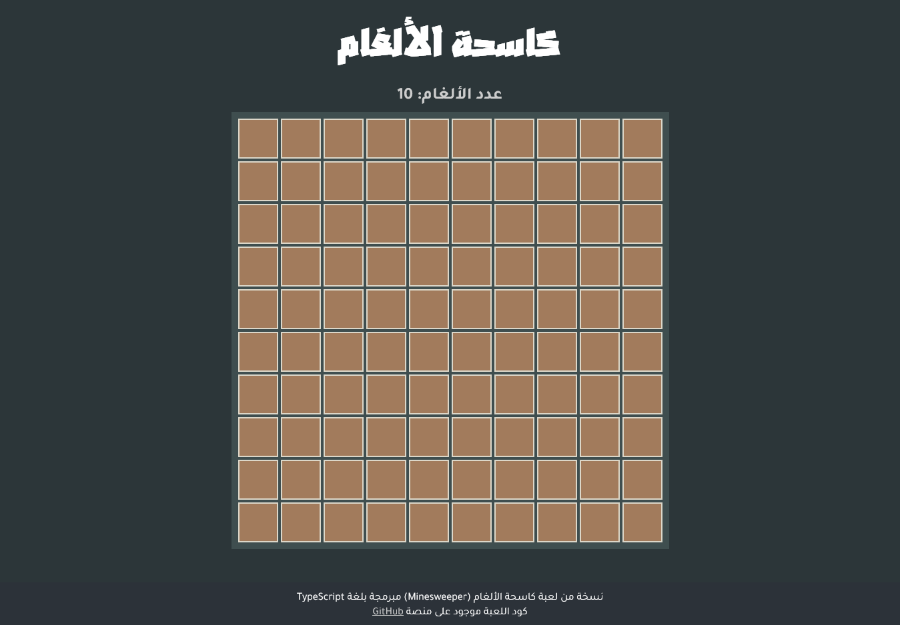

# Minsweeper Game | كاسحة الألغام



## مقدمة

نسخة مبسطة من هذه اللعبة الكلاسيكية استمتعت ببرمجتها وطريقة جيدة لتعلم استخدام تايبسكريبت.

الكود أغلبه من درس في اليوتيوب لكن معدل عليه كثيرا، ففي الفيدو استخدم الجافاسكريبت وأنا استخدمت التايبسكريبت وتعديلات أخرى على الواجهة.

رابط الدرس لمن يريد الإطلاع: [هنا](<[https://](https://youtu.be/kBMnD_aElCQ)>)

## للاستعمال

يمكنكم لعب اللعبة عبر الموقع: [Minesweeper](https://minesweeper-ar.dev)

ولم أراد تشغيلها على حاسوبه الشخصي يتفضل بنسخ الكود على جهازه ويتبع الخطوات التالية:

ثبت الأدوات المستعملة في الكود (dependencies):

```npm
npm install
```

ثم شغل اللعبة:

```npm
npm run dev
```

## تواصل معي

**[التيليغرام](https://t.me/mouaadhamza)**

**[الفيسبوك](https://www.facebook.com/mouaadev/)**

**[التويتر](https://twitter.com/mouaadev)**
